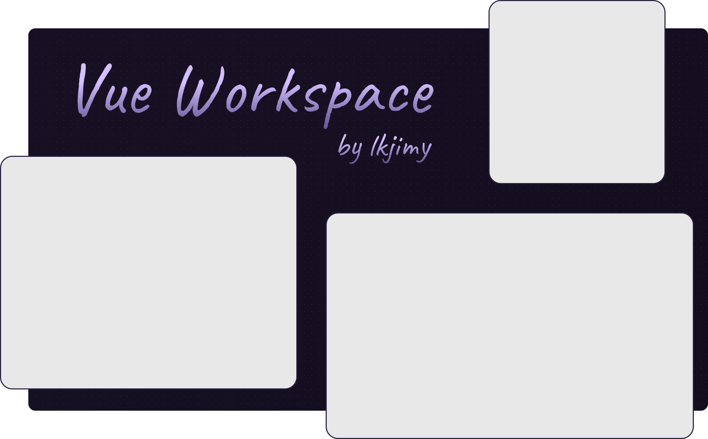

# Vue Workspace, by @lkjimy

A Vue 3 based, grid workspace component with draggable tiles.

## Features

- Create a grid workspace with tiles of any size.
- Tiles can be dragged around the workspace.
- Workspace can be set to be editable or not, to stop users from dragging tiles.
- Set the size of the workspace, and the size of the tiles.
